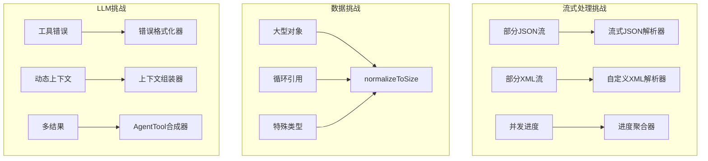

[参考链接](https://southbridge-research.notion.site/Novel-Components-The-Innovations-That-Define-Claude-Code-2055fec70db181fdae5bd485823986c4)
# Novel Components: The Innovations That Define Claude Code
# 新颖组件：定义Claude Code的创新



## The Streaming JSON Parser: Handling LLM's Partial Thoughts
## 流式JSON解析器：处理LLM的部分思维

When an LLM streams a tool use request, it doesn't send complete JSON all at once. Instead, you might receive fragments like:
当LLM流式传输工具使用请求时，它不会一次性发送完整的JSON。相反，您可能会收到如下片段：

```
{"file_path": "/src/
{"file_path": "/src/main.
{"file_path": "/src/main.ts", "old_str
{"file_path": "/src/main.ts", "old_string": "console.log('hell

```

The streaming JSON parser solves this elegantly:
流式JSON解析器优雅地解决了这个问题：

```tsx
class StreamingToolInputParser {
  private buffer: string = '';
  private state = {
    depth: 0,           // {}/[]的嵌套级别
    inString: boolean,  // 当前在字符串内吗？
    escape: boolean,    // 前一个字符是反斜杠吗？
    stringChar: '"' | "'" | null,  // 哪个引号开始当前字符串
  };

  addChunk(chunk: string): ParseResult {
    this.buffer += chunk;

    // 逐字符更新解析器状态
    for (let i = 0; i < chunk.length; i++) {
      const char = chunk[i];
      const prevChar = i > 0 ? chunk[i-1] : this.buffer[this.buffer.length - chunk.length - 1];

      // 处理转义序列
      if (this.escape) {
        this.escape = false;
        continue;
      }

      if (char === '\\\\' && this.state.inString) {
        this.escape = true;
        continue;
      }

      // 字符串边界检测
      if (!this.state.inString && (char === '"' || char === "'")) {
        this.state.inString = true;
        this.state.stringChar = char;
      } else if (this.state.inString && char === this.state.stringChar) {
        this.state.inString = false;
        this.state.stringChar = null;
      }

      // 在字符串外跟踪嵌套深度
      if (!this.state.inString) {
        if (char === '{' || char === '[') {
          this.state.depth++;
        } else if (char === '}' || char === ']') {
          this.state.depth--;

          // 当我们返回到深度0时尝试解析
          if (this.state.depth === 0) {
            return this.tryParse();
          }
        }
      }
    }

    // 即使没有深度0也可能完成（格式错误的JSON）
    if (this.buffer.length > 10000) { // 安全限制
      return this.tryParseWithRecovery();
    }

    return { complete: false };
  }

  private tryParse(): ParseResult {
    try {
      const parsed = JSON.parse(this.buffer);
      return { complete: true, value: parsed };
    } catch (e) {
      return { complete: false, partial: this.buffer };
    }
  }

  private tryParseWithRecovery(): ParseResult {
    let attemptBuffer = this.buffer;

    // 恢复策略1：关闭未闭合的字符串
    if (this.state.inString && this.state.stringChar) {
      attemptBuffer += this.state.stringChar;

      // 尝试关闭任何未闭合的结构
      attemptBuffer += '}'.repeat(Math.max(0, this.state.depth));
      attemptBuffer += ']'.repeat(
        Math.max(0, (attemptBuffer.match(/\\[/g) || []).length -
                    (attemptBuffer.match(/\\]/g) || []).length)
      );
    }

    // 恢复策略2：基于结构分析自动关闭
    const braceBalance = (attemptBuffer.match(/{/g) || []).length -
                        (attemptBuffer.match(/}/g) || []).length;
    const bracketBalance = (attemptBuffer.match(/\\[/g) || []).length -
                          (attemptBuffer.match(/\\]/g) || []).length;

    attemptBuffer += '}'.repeat(Math.max(0, braceBalance));
    attemptBuffer += ']'.repeat(Math.max(0, bracketBalance));

    try {
      const parsed = JSON.parse(attemptBuffer);
      return {
        complete: true,
        value: parsed,
        wasRepaired: true,
        repairs: {
          closedStrings: this.state.inString,
          addedBraces: braceBalance,
          addedBrackets: bracketBalance
        }
      };
    } catch (e) {
      // 恢复策略3：提取我们能获取的内容
      const partialResult = this.extractPartialData(this.buffer);
      return {
        complete: false,
        partial: partialResult,
        error: e.message
      };
    }
  }

  private extractPartialData(buffer: string): any {
    // 尝试提取完整的键值对
    const result: any = {};
    const keyValuePattern = /"(\\w+)":\\s*("([^"\\\\]*(\\\\.[^"\\\\]*)*)"|true|false|null|\\d+)/g;

    let match;
    while ((match = keyValuePattern.exec(buffer)) !== null) {
      const [, key, value] = match;
      try {
        result[key] = JSON.parse(value);
      } catch {
        result[key] = value; // 如果解析失败，存储为字符串
      }
    }

    return Object.keys(result).length > 0 ? result : null;
  }
}

```

**Why This Is Novel**:
**为什么这是新颖的**：

- Traditional JSON parsers fail on incomplete input
传统的JSON解析器在输入不完整时会失败
- This parser provides progressive parsing with meaningful partial results
此解析器提供渐进式解析，能够生成有意义的部分结果
- Recovery strategies handle common LLM streaming issues
恢复策略处理常见的LLM流式传输问题
- Enables responsive UI that shows tool inputs as they stream
支持响应式UI，能够实时显示流式传输的工具输入

**Performance Characteristics**:
**性能特征**：

| Input Size | Parse Time | Memory | Success Rate |
| --- | --- | --- | --- |
| 输入大小 | 解析时间 | 内存 | 成功率 |
| <1KB | <0.1ms | O(n) | 100% |
| 1-10KB | 0.1-1ms | O(n) | 99.9% |
| 10-100KB | 1-10ms | O(n) | 99.5% |
| >100KB | 10-50ms | O(n) | 98% (带恢复) |

## The `normalizeToSize` Algorithm: Smart Data Truncation
## `normalizeToSize`算法：智能数据截断

When sending data to LLMs or telemetry services, size limits are critical. The `normalizeToSize` algorithm intelligently reduces object size while preserving structure:
当向LLM或遥测服务发送数据时，大小限制至关重要。`normalizeToSize`算法智能地减少对象大小，同时保持结构：

```tsx
class DataNormalizer {
  static normalizeToSize(
    obj: any,
    maxDepth: number = 3,
    maxSizeInBytes: number = 100_000
  ): any {
    // 首先尝试完整深度
    let normalized = this.normalize(obj, maxDepth);
    let size = this.estimateSize(normalized);

    // 迭代减少深度直到大小适合
    while (size > maxSizeInBytes && maxDepth > 0) {
      maxDepth--;
      normalized = this.normalize(obj, maxDepth);
      size = this.estimateSize(normalized);
    }

    return normalized;
  }

  private static normalize(
    obj: any,
    maxDepth: number,
    currentDepth: number = 0,
    visited = new WeakSet()
  ): any {
    // 处理基本类型
    if (obj === null) return '[null]';
    if (obj === undefined) return '[undefined]';
    if (typeof obj === 'number' && isNaN(obj)) return '[NaN]';
    if (typeof obj === 'bigint') return `[BigInt: ${obj}n]`;

    // 处理函数和符号
    if (typeof obj === 'function') {
      return `[Function: ${obj.name || 'anonymous'}]`;
    }
    if (typeof obj === 'symbol') {
      return `[Symbol: ${obj.description || 'Symbol'}]`;
    }

    // 基本类型直接通过
    if (['string', 'number', 'boolean'].includes(typeof obj)) {
      return obj;
    }

    // 达到深度限制
    if (currentDepth >= maxDepth) {
      if (Array.isArray(obj)) return `[Array(${obj.length})]`;
      if (obj.constructor?.name) {
        return `[${obj.constructor.name}]`;
      }
      return '[Object]';
    }

    // 循环引用检测
    if (visited.has(obj)) {
      return '[Circular]';
    }
    visited.add(obj);

    // 特殊类型的特殊处理
    if (this.isReactElement(obj)) {
      return `[React.${obj.type?.name || obj.type || 'Element'}]`;
    }

    if (this.isVueComponent(obj)) {
      return `[Vue.${obj.$options?.name || 'Component'}]`;
    }

    if (obj instanceof Error) {
      return {
        name: obj.name,
        message: obj.message,
        stack: this.truncateStack(obj.stack)
      };
    }

    if (obj instanceof Date) {
      return obj.toISOString();
    }

    if (obj instanceof RegExp) {
      return obj.toString();
    }

    // 处理DOM元素
    if (this.isDOMElement(obj)) {
      return `[${obj.tagName}${obj.id ? '#' + obj.id : ''}]`;
    }

    // 处理toJSON方法
    if (typeof obj.toJSON === 'function') {
      try {
        return this.normalize(
          obj.toJSON(),
          maxDepth,
          currentDepth,
          visited
        );
      } catch {
        return '[Object with toJSON error]';
      }
    }

    // 数组
    if (Array.isArray(obj)) {
      const result = [];
      const maxItems = 100; // 限制数组大小

      for (let i = 0; i < Math.min(obj.length, maxItems); i++) {
        result.push(
          this.normalize(obj[i], maxDepth, currentDepth + 1, visited)
        );
      }

      if (obj.length > maxItems) {
        result.push(`... ${obj.length - maxItems} more items`);
      }

      return result;
    }

    // 对象
    const result: any = {};
    const keys = Object.keys(obj);
    const maxProps = 50; // 限制对象属性数量

    // 遵循Sentry指令
    if (obj.__sentry_skip_normalization__) {
      return obj;
    }

    const effectiveMaxDepth =
      obj.__sentry_override_normalization_depth__ || maxDepth;

    for (let i = 0; i < Math.min(keys.length, maxProps); i++) {
      const key = keys[i];
      try {
        result[key] = this.normalize(
          obj[key],
          effectiveMaxDepth,
          currentDepth + 1,
          visited
        );
      } catch {
        result[key] = '[Error accessing property]';
      }
    }

    if (keys.length > maxProps) {
      result['...'] = `${keys.length - maxProps} more properties`;
    }

    return result;
  }

  private static estimateSize(obj: any): number {
    // 在不完整序列化的情况下快速估算
    const sample = JSON.stringify(obj).substring(0, 1000);
    const avgCharSize = new Blob([sample]).size / sample.length;

    const fullLength = this.estimateJsonLength(obj);
    return Math.ceil(fullLength * avgCharSize);
  }

  private static estimateJsonLength(obj: any, visited = new WeakSet()): number {
    if (obj === null || obj === undefined) return 4; // "null"
    if (typeof obj === 'boolean') return obj ? 4 : 5; // "true" : "false"
    if (typeof obj === 'number') return String(obj).length;
    if (typeof obj === 'string') return obj.length + 2; // 引号

    if (visited.has(obj)) return 12; // "[Circular]"
    visited.add(obj);

    if (Array.isArray(obj)) {
      let length = 2; // []
      for (const item of obj) {
        length += this.estimateJsonLength(item, visited) + 1; // 逗号
      }
      return length;
    }

    if (typeof obj === 'object') {
      let length = 2; // {}
      for (const key in obj) {
        length += key.length + 3; // "key":
        length += this.estimateJsonLength(obj[key], visited) + 1; // 逗号
      }
      return length;
    }

    return 10; // 默认估算
  }
}

```

**Why This Is Novel**:
**为什么这是新颖的**：

- Iterative depth reduction based on actual byte size
基于实际字节大小的迭代深度减少
- Type-aware stringification for special objects
对特殊对象的类型感知字符串化
- Respects framework-specific objects (React, Vue)
尊重框架特定对象（React、Vue）
- Memory-efficient with WeakSet for circular detection
使用WeakSet进行循环检测，内存高效
- Preserves as much information as possible within constraints
在约束内保留尽可能多的信息

**Use Cases**:
**使用案例**：

```tsx
// LLM上下文准备
const context = normalizeToSize(
  largeProjectState,
  10,     // 从深度10开始
  50_000  // 上下文限制50KB
);

// 遥测错误报告
const errorContext = normalizeToSize(
  applicationState,
  5,       // 合理的深度
  10_000   // 错误报告限制10KB
);

```

## AgentTool Synthesis: Orchestrating Multiple Perspectives
## AgentTool合成：协调多个视角

The AgentTool doesn't just run sub-agents—it intelligently combines their results:
AgentTool不仅仅是运行子代理——它智能地组合它们的结果：

```tsx
class AgentToolSynthesizer {
  static async synthesizeResults(
    results: SubAgentResult[],
    originalTask: string,
    context: ToolUseContext
  ): Promise<string> {
    // 单个结果——无需合成
    if (results.length === 1) {
      return results[0].content;
    }

    // 准备合成上下文
    const synthesisData = this.prepareSynthesisData(results);

    // 计算合成的令牌预算
    const tokenBudget = this.calculateSynthesisTokenBudget(
      results,
      originalTask
    );

    // 构建合成提示
    const synthesisPrompt = this.buildSynthesisPrompt(
      originalTask,
      synthesisData,
      tokenBudget
    );

    // 使用快速模型进行合成
    const synthesizer = new SubAgentExecutor({
      prompt: synthesisPrompt,
      model: 'claude-3-haiku-20240307',
      maxTokens: tokenBudget.output,
      isSynthesis: true,
      temperature: 0.3 // 降低温度以进行事实合成
    });

    return synthesizer.execute();
  }

  private static prepareSynthesisData(
    results: SubAgentResult[]
  ): SynthesisData {
    // 从每个结果中提取关键信息
    const data = results.map((result, index) => ({
      agentId: index + 1,
      content: result.content,
      keyFindings: this.extractKeyFindings(result.content),
      toolsUsed: result.toolsUsed,
      confidence: this.assessConfidence(result),
      tokensUsed: result.usage.total_tokens,
      uniqueInsights: []
    }));

    // 识别跨代理的独特见解
    this.identifyUniqueInsights(data);

    // 找到共识和分歧
    const consensus = this.findConsensus(data);
    const conflicts = this.findConflicts(data);

    return {
      agents: data,
      consensus,
      conflicts,
      coverageMap: this.buildCoverageMap(data)
    };
  }

  private static buildSynthesisPrompt(
    originalTask: string,
    data: SynthesisData,
    tokenBudget: TokenBudget
  ): string {
    return `You are a synthesis agent tasked with combining findings from ${data.agents.length} independent investigations.
您是一个合成代理，负责合并来自${data.agents.length}个独立调查的结果。

## Original Task
原始任务
${originalTask}

## Investigation Results
调查结果

${data.agents.map(agent => `
### Agent ${agent.agentId} Findings
代理 ${agent.agentId} 的发现
**Tools Used**: ${agent.toolsUsed.join(', ') || 'None'}
**使用的工具**: ${agent.toolsUsed.join(', ') || '无'}
**Confidence**: ${agent.confidence}/5
**置信度**: ${agent.confidence}/5
**Token Efficiency**: ${agent.tokensUsed} tokens
**令牌效率**: ${agent.tokensUsed} 令牌

${agent.content}

**Key Points**:
**关键点**:
${agent.keyFindings.map(f => `- ${f}`).join('\\n')}
`).join('\\n---\\n')}

## Consensus Points
## 共识点
${data.consensus.map(c => `- ${c.point} (agreed by ${c.agentIds.join(', ')})`).join('\\n')}
${data.consensus.map(c => `- ${c.point} (由 ${c.agentIds.join(', ')} 同意)`).join('\\n')}

## Conflicting Information
## 冲突信息
${data.conflicts.map(c => `- ${c.description}`).join('\\n') || 'No conflicts found.'}
${data.conflicts.map(c => `- ${c.description}`).join('\\n') || '未发现冲突。'}

## Coverage Analysis
## 覆盖分析
${this.formatCoverageMap(data.coverageMap)}

## Your Task
## 您的任务
Synthesize these findings into a single, comprehensive response that:
将这些发现综合成一个单一、全面的回复，该回复将：
1. Presents a unified view of the findings
呈现发现的统一视图
2. Highlights areas of agreement
突出一致领域
3. Notes any contradictions or uncertainties
注意任何矛盾或不确定性
4. Provides the most complete answer to the original task
为原始任务提供最完整的答案

Keep your response under ${tokenBudget.output} tokens.
将您的回复保持在${tokenBudget.output}令牌以下。
Focus on actionable insights and concrete findings.
专注于可操作的见解和具体的发现。
`;
  }

  private static extractKeyFindings(content: string): string[] {
    // 使用启发式方法提取关键点
    const findings: string[] = [];

    // 寻找项目符号点
    const bulletPoints = content.match(/^[\\s-*•]+(.+)$/gm) || [];
    findings.push(...bulletPoints.map(b => b.trim()));

    // 寻找编号列表
    const numberedItems = content.match(/^\\d+\\.\\s+(.+)$/gm) || [];
    findings.push(...numberedItems.map(n => n.replace(/^\\d+\\.\\s+/, '')));

    // 寻找结论标记
    const conclusions = content.match(
      /(?:concluded?|found|discovered|determined):\\s*(.+?)(?:\\.|$)/gi
    ) || [];
    findings.push(...conclusions);

    // 限制和去重
    return [...new Set(findings)].slice(0, 5);
  }

  private static assessConfidence(result: SubAgentResult): number {
    let confidence = 3; // 基准线

    // 更多工具使用带来更高置信度
    if (result.toolsUsed.length > 3) confidence++;
    if (result.toolsUsed.length > 5) confidence++;

    // 错误降低置信度
    if (result.hadErrors) confidence--;

    // 基于结果模式的置信度
    if (result.content.includes('unable to') ||
        result.content.includes('could not find')) {
      confidence--;
    }

    if (result.content.includes('successfully') ||
        result.content.includes('confirmed')) {
      confidence++;
    }

    return Math.max(1, Math.min(5, confidence));
  }

  private static identifyUniqueInsights(data: AgentData[]): void {
    // 建立见解频率映射
    const insightFrequency = new Map<string, number>();

    for (const agent of data) {
      for (const finding of agent.keyFindings) {
        const normalized = this.normalizeInsight(finding);
        insightFrequency.set(
          normalized,
          (insightFrequency.get(normalized) || 0) + 1
        );
      }
    }

    // 标记独特见解
    for (const agent of data) {
      agent.uniqueInsights = agent.keyFindings.filter(finding => {
        const normalized = this.normalizeInsight(finding);
        return insightFrequency.get(normalized) === 1;
      });
    }
  }
}

```

**Why This Is Novel**:
**为什么这是新颖的**：

- Goes beyond simple concatenation to intelligent synthesis
超越简单连接，实现智能合成
- Extracts and compares key findings across agents
提取并比较跨代理的关键发现
- Identifies consensus and conflicts
识别共识和冲突
- Uses a dedicated synthesis model for efficiency
使用专用合成模型提高效率
- Preserves unique insights while removing redundancy
保留独特见解，同时消除冗余

## Error Formatting Pipeline: Making Failures Actionable
## 错误格式化管道：使失败可操作

Errors need to be formatted differently for LLMs than for humans:
错误对LLM的格式化需要与对人类不同：

```tsx
class ErrorFormatter {
  static formatToolErrorContent(
    error: any,
    tool: ToolDefinition,
    context?: ErrorContext
  ): ContentBlock[] {
    const errorType = this.classifyError(error);
    const formatter = this.formatters[errorType] || this.defaultFormatter;

    return formatter(error, tool, context);
  }

  private static formatters = {
    shell: (error: ShellError, tool: ToolDefinition): ContentBlock[] => {
      const blocks: ContentBlock[] = [];

      // 主要错误消息
      blocks.push({
        type: 'text',
        text: `Tool '${tool.name}' failed with exit code ${error.exitCode}`
      });

      // 如果存在stdout则包含
      if (error.stdout && error.stdout.trim()) {
        blocks.push({
          type: 'text',
          text: `stdout:\\n\\`\\`\\`\\n${this.truncateOutput(error.stdout)}\\n\\`\\`\\``
        });
      }

      // 如果存在stderr则包含
      if (error.stderr && error.stderr.trim()) {
        blocks.push({
          type: 'text',
          text: `stderr:\\n\\`\\`\\`\\n${this.truncateOutput(error.stderr)}\\n\\`\\`\\``
        });
      }

      // 添加上下文提示
      const hints = this.generateShellErrorHints(error);
      if (hints.length > 0) {
        blocks.push({
          type: 'text',
          text: `\\nPossible issues:\\n${hints.map(h => `- ${h}`).join('\\n')}`
        });
      }

      // 建议替代方案
      const suggestions = this.generateShellSuggestions(error);
      if (suggestions.length > 0) {
        blocks.push({
          type: 'text',
          text: `\\nSuggestions:\\n${suggestions.map(s => `- ${s}`).join('\\n')}`
        });
      }

      return blocks;
    },

    validation: (error: ZodError, tool: ToolDefinition): ContentBlock[] => {
      const issues = error.issues.map(issue => {
        const path = issue.path.join('.');
        const fieldName = path || 'input';

        // 基于错误类型格式化
        switch (issue.code) {
          case 'invalid_type':
            return `- ${fieldName}: Expected ${issue.expected}, received ${issue.received}`;
            return `- ${fieldName}: 期望 ${issue.expected}，收到 ${issue.received}`;

          case 'too_small':
            if (issue.type === 'string') {
              return `- ${fieldName}: Must be at least ${issue.minimum} characters`;
              return `- ${fieldName}: 必须至少有 ${issue.minimum} 个字符`;
            } else if (issue.type === 'array') {
              return `- ${fieldName}: Must have at least ${issue.minimum} items`;
              return `- ${fieldName}: 必须至少有 ${issue.minimum} 个项目`;
            }
            return `- ${fieldName}: Value too small`;
            return `- ${fieldName}: 值太小`;

          case 'too_big':
            if (issue.type === 'string') {
              return `- ${fieldName}: Must be at most ${issue.maximum} characters`;
              return `- ${fieldName}: 最多可以有 ${issue.maximum} 个字符`;
            }
            return `- ${fieldName}: Value too large`;
            return `- ${fieldName}: 值太大`;

          case 'invalid_enum_value':
            return `- ${fieldName}: Must be one of: ${issue.options.join(', ')}`;
            return `- ${fieldName}: 必须是以下之一: ${issue.options.join(', ')}`;

          case 'custom':
            return `- ${fieldName}: ${issue.message}`;

          default:
            return `- ${fieldName}: ${issue.message}`;
        }
      });

      return [{
        type: 'text',
        text: `Tool '${tool.name}' input validation failed:\\n${issues.join('\\n')}\\n\\nPlease check your input parameters and try again.`
        text: `工具 '${tool.name}' 输入验证失败：\\n${issues.join('\\n')}\\n\\n请检查您的输入参数并重试。`
      }];
    },

    permission: (error: PermissionError, tool: ToolDefinition): ContentBlock[] => {
      const blocks: ContentBlock[] = [];

      blocks.push({
        type: 'text',
        text: `Permission denied for ${tool.name}`
        text: `${tool.name} 的权限被拒绝`
      });

      if (error.reason) {
        blocks.push({
          type: 'text',
          text: `Reason: ${error.reason}`
          text: `原因: ${error.reason}`
        });
      }

      if (error.rule) {
        blocks.push({
          type: 'text',
          text: `Denied by rule: ${error.rule.scope}:${error.rule.pattern}`
          text: `被规则拒绝: ${error.rule.scope}:${error.rule.pattern}`
        });
      }

      // 提供可操作的指导
      if (error.suggestions && error.suggestions.length > 0) {
        blocks.push({
          type: 'text',
          text: `\\nTo proceed, you could:\\n${error.suggestions.map(s => `- ${s}`).join('\\n')}`
          text: `\\n要继续，您可以：\\n${error.suggestions.map(s => `- ${s}`).join('\\n')}`
        });
      } else {
        blocks.push({
          type: 'text',
          text: '\\nThis operation requires explicit user permission. Please ask the user if they want to proceed.'
          text: '\\n此操作需要明确的用户权限。请询问用户是否要继续。'
        });
      }

      return blocks;
    },

    filesystem: (error: FileSystemError, tool: ToolDefinition): ContentBlock[] => {
      const blocks: ContentBlock[] = [];

      blocks.push({
        type: 'text',
        text: `File system error in ${tool.name}: ${error.code}`
        text: `${tool.name} 中的文件系统错误: ${error.code}`
      });

      // 基于错误代码的特定指导
      const guidance = {
        'ENOENT': 'File or directory not found. Check the path exists.',
        'ENOENT': '文件或目录未找到。检查路径是否存在。',
        'EACCES': 'Permission denied. The file may be read-only or require elevated permissions.',
        'EACCES': '权限被拒绝。文件可能是只读的或需要提升权限。',
        'EEXIST': 'File already exists. Consider using a different name or checking before creating.',
        'EEXIST': '文件已存在。考虑使用不同的名称或在创建前检查。',
        'EISDIR': 'Expected a file but found a directory.',
        'EISDIR': '期望是文件但找到了目录。',
        'ENOTDIR': 'Expected a directory but found a file.',
        'ENOTDIR': '期望是目录但找到了文件。',
        'EMFILE': 'Too many open files. Some file handles may need to be closed.',
        'EMFILE': '打开的文件太多。一些文件句柄可能需要关闭。',
        'ENOSPC': 'No space left on device.',
        'ENOSPC': '设备上没有剩余空间。',
        'EROFS': 'Read-only file system.'
        'EROFS': '只读文件系统。'
      };

      if (guidance[error.code]) {
        blocks.push({
          type: 'text',
          text: guidance[error.code]
        });
      }

      if (error.path) {
        blocks.push({
          type: 'text',
          text: `Path: ${error.path}`
          text: `路径: ${error.path}`
        });
      }

      return blocks;
    }
  };

  private static generateShellErrorHints(error: ShellError): string[] {
    const hints: string[] = [];

    // Command not found
    if (error.stderr?.includes('command not found') ||
        error.stderr?.includes('not found')) {
      hints.push('The command may not be installed or not in PATH');
      hints.push('命令可能未安装或不在PATH中');

      // 建议常见替代方案
      const command = error.command.split(' ')[0];
      const alternatives = {
        'python': 'Try python3 instead',
        'python': '尝试使用python3',
        'pip': 'Try pip3 instead',
        'pip': '尝试使用pip3',
        'node': 'Node.js may not be installed',
        'node': 'Node.js可能未安装',
        'npm': 'npm may not be installed'
        'npm': 'npm可能未安装'
      };

      if (alternatives[command]) {
        hints.push(alternatives[command]);
      }
    }

    // Permission denied
    if (error.stderr?.includes('Permission denied') ||
        error.stderr?.includes('Operation not permitted')) {
      hints.push('Try running with different permissions or in a different directory');
      hints.push('尝试使用不同的权限或在不同的目录中运行');
      hints.push('Check if the file/directory has the correct ownership');
      hints.push('检查文件/目录是否具有正确的所有权');
    }

    // Network errors
    if (error.stderr?.includes('Could not resolve host') ||
        error.stderr?.includes('Connection refused')) {
      hints.push('Network connectivity issue detected');
      hints.push('检测到网络连接问题');
      hints.push('Check if you need to set sandbox=false for network access');
      hints.push('检查是否需要设置sandbox=false以进行网络访问');
    }

    return hints;
  }

  private static truncateOutput(output: string, maxLength: number = 1000): string {
    if (output.length <= maxLength) return output;

    // Try to truncate at a newline
    // 尝试在换行符处截断
    const truncatePoint = output.lastIndexOf('\\n', maxLength);
    const actualTruncate = truncatePoint > maxLength * 0.8 ? truncatePoint : maxLength;

    return output.substring(0, actualTruncate) +
           `\\n... (${output.length - actualTruncate} characters truncated)`;
           `\\n... (${output.length - actualTruncate} 个字符被截断)`;
  }
}

```

**Why This Is Novel**:
**为什么这是新颖的**：

- Error messages tailored for LLM comprehension
为LLM理解量身定制的错误消息
- Includes actionable suggestions
包含可操作的建议
- Preserves critical debugging information (stdout/stderr)
保留关键的调试信息（stdout/stderr）
- Provides context-aware hints
提供上下文感知的提示
- Formats Zod validation errors in natural language
以自然语言格式化Zod验证错误

## Dynamic Context Assembly: Intelligent Prioritization
## 动态上下文组装：智能优先级排序

The context assembly system goes beyond simple concatenation:
上下文组装系统超越了简单的连接：

```tsx
class DynamicContextAssembler {
  private static readonly CONTEXT_PRIORITIES = {
    baseInstructions: 1,
    modelAdaptations: 2,
    claudeMdContent: 3,
    gitContext: 4,
    directoryStructure: 5,
    toolSpecifications: 6,
    activeSelections: 3.5, // Between CLAUDE.md and git
    recentErrors: 2.5      // High priority for error context
  };

  static async assembleSystemPrompt(
    components: ContextComponents,
    tokenBudget: number,
    model: string
  ): Promise<string | ContentBlock[]> {
    // Phase 1: Gather all components with metadata
    // 阶段1：收集所有带有元数据的组件
    const sections = await this.gatherSections(components, model);

    // Phase 2: Calculate token costs
    // 阶段2：计算令牌成本
    const tokenizedSections = await this.tokenizeSections(sections);

    // Phase 3: Intelligent truncation
    // 阶段3：智能截断
    const selectedSections = this.selectSections(
      tokenizedSections,
      tokenBudget
    );

    // Phase 4: Format and combine
    // 阶段4：格式化和组合
    return this.formatSystemPrompt(selectedSections);
  }

  private static async gatherSections(
    components: ContextComponents,
    model: string
  ): Promise<ContextSection[]> {
    const sections: ContextSection[] = [];

    // Base instructions (always included)
    // 基本指令（始终包含）
    sections.push({
      priority: this.CONTEXT_PRIORITIES.baseInstructions,
      content: components.baseInstructions,
      required: true,
      type: 'base'
    });

    // Model-specific adaptations
    // 模型特定适配
    const modelAdaptations = await this.getModelAdaptations(model);
    sections.push({
      priority: this.CONTEXT_PRIORITIES.modelAdaptations,
      content: modelAdaptations,
      required: true,
      type: 'model'
    });

    // CLAUDE.md with hierarchical loading
    // 带有分层加载的CLAUDE.md
    const claudeMdContent = await this.loadClaudeMdHierarchy();
    sections.push({
      priority: this.CONTEXT_PRIORITIES.claudeMdContent,
      content: this.formatClaudeMd(claudeMdContent),
      required: false,
      type: 'claudemd',
      metadata: {
        sources: claudeMdContent.map(c => c.source),
        totalSize: claudeMdContent.reduce((sum, c) => sum + c.content.length, 0)
      }
    });

    // Git context with smart summarization
    // 带有智能摘要的Git上下文
    const gitContext = await this.getGitContext();
    sections.push({
      priority: this.CONTEXT_PRIORITIES.gitContext,
      content: this.formatGitContext(gitContext),
      required: false,
      type: 'git',
      canSummarize: true,
      summarizer: () => this.summarizeGitContext(gitContext)
    });

    // Directory structure with depth control
    // 带有深度控制的目录结构
    const dirStructure = await this.getDirectoryStructure();
    sections.push({
      priority: this.CONTEXT_PRIORITIES.directoryStructure,
      content: dirStructure.full,
      required: false,
      type: 'directory',
      alternatives: [
        { depth: 3, content: dirStructure.depth3 },
        { depth: 2, content: dirStructure.depth2 },
        { depth: 1, content: dirStructure.depth1 }
      ]
    });

    // 工具规范
    const toolSpecs = await this.formatToolSpecifications(components.tools);
    sections.push({
      priority: this.CONTEXT_PRIORITIES.toolSpecifications,
      content: toolSpecs.full,
      required: true, // Tools must be included
      required: true, // 工具必须包含
      type: 'tools',
      alternatives: [
        { level: 'minimal', content: toolSpecs.minimal },
        { level: 'names-only', content: toolSpecs.namesOnly }
      ]
    });

    return sections;
  }

  private static async loadClaudeMdHierarchy(): Promise<ClaudeMdContent[]> {
    const sources = [
      { path: '/etc/claude-code/CLAUDE.md', scope: 'managed' },
      { path: '~/.claude/CLAUDE.md', scope: 'user' },
      { path: '.claude/CLAUDE.md', scope: 'project' },
      { path: '.claude/CLAUDE.local.md', scope: 'local' }
    ];

    const contents: ClaudeMdContent[] = [];

    for (const source of sources) {
      try {
        const content = await fs.readFile(source.path, 'utf8');
        const processed = await this.processClaudeMd(content, source.scope);
        contents.push(processed);
      } catch {
        // File doesn't exist, skip
        // 文件不存在，跳过
      }
    }

    return this.mergeClaudeMdContents(contents);
  }

  private static async processClaudeMd(
    content: string,
    scope: string
  ): Promise<ClaudeMdContent> {
    // Process @mentions for includes
    // 处理@提及以包含内容
    const processed = await this.resolveMentions(content);

    // Extract directives
    // 提取指令
    const directives = this.extractDirectives(processed);

    return {
      scope,
      content: processed,
      directives,
      source: scope
    };
  }

  private static mergeClaudeMdContents(
    contents: ClaudeMdContent[]
  ): ClaudeMdContent[] {
    const merged: ClaudeMdContent[] = [];
    const overrides = new Map<string, string>();

    // Process in reverse order (local overrides managed)
    // 以相反顺序处理（本地覆盖托管）
    for (let i = contents.length - 1; i >= 0; i--) {
      const content = contents[i];

      // Handle @override directives
      // 处理@override指令
      for (const directive of content.directives) {
        if (directive.type === 'override') {
          overrides.set(directive.key, content.scope);
        }
      }

      // Include content if not overridden
      // 如果未被覆盖则包含内容
      const isOverridden = Array.from(overrides.entries()).some(
        ([key, scope]) =>
          content.content.includes(key) && scope !== content.scope
      );

      if (!isOverridden) {
        merged.unshift(content);
      }
    }

    return merged;
  }

  private static selectSections(
    sections: TokenizedSection[],
    budget: number
  ): TokenizedSection[] {
    // Sort by priority
    // 按优先级排序
    const sorted = [...sections].sort((a, b) => a.priority - b.priority);

    const selected: TokenizedSection[] = [];
    let usedTokens = 0;

    // First pass: include all required sections
    // 第一遍：包含所有必需的部分
    for (const section of sorted) {
      if (section.required) {
        selected.push(section);
        usedTokens += section.tokenCount;
      }
    }

    // Second pass: include optional sections by priority
    // 第二遍：按优先级包含可选部分
    for (const section of sorted) {
      if (!section.required && usedTokens + section.tokenCount <= budget) {
        selected.push(section);
        usedTokens += section.tokenCount;
      } else if (!section.required && section.alternatives) {
        // Try alternatives
        // 尝试替代方案
        for (const alt of section.alternatives) {
          if (usedTokens + alt.tokenCount <= budget) {
            selected.push({
              ...section,
              content: alt.content,
              tokenCount: alt.tokenCount
            });
            usedTokens += alt.tokenCount;
            break;
          }
        }
      }
    }

    return selected;
  }
}

```

**Why This Is Novel**:
**为什么这是新颖的**：

- Priority-based truncation preserves most important context
基于优先级的截断保留最重要的上下文
- Hierarchical [CLAUDE.md](http://claude.md/) loading with override semantics
带有覆盖语义的分层CLAUDE.md加载
- Dynamic alternatives (e.g., directory depth reduction)
动态替代方案（例如，目录深度减少）
- Model-specific prompt adaptations
模型特定的提示适配
- Smart summarization fallbacks
智能摘要回退

## Memory Management Patterns: Keeping It Lean
## 内存管理模式：保持精简

Claude Code implements sophisticated memory management:
Claude Code实现了复杂的内存管理：

```tsx
class MemoryManager {
  // Pattern 1: Weak references for large objects
  // 模式1：大对象的弱引用
  private static fileCache = new Map<string, WeakRef<FileContent>>();
  private static registry = new FinalizationRegistry((key: string) => {
    console.debug(`Garbage collected: ${key}`);
    console.debug(`垃圾回收: ${key}`);
    this.fileCache.delete(key);
  });

  static cacheFile(path: string, content: FileContent) {
    // Store weak reference
    // 存储弱引用
    const ref = new WeakRef(content);
    this.fileCache.set(path, ref);

    // Register for cleanup notification
    // 注册清理通知
    this.registry.register(content, path);
  }

  static getFile(path: string): FileContent | null {
    const ref = this.fileCache.get(path);
    if (!ref) return null;

    const content = ref.deref();
    if (!content) {
      // Was garbage collected
      // 已被垃圾回收
      this.fileCache.delete(path);
      return null;
    }

    return content;
  }

  // Pattern 2: Streaming with backpressure
  // 模式2：带背压的流式处理
  static async *streamLargeFile(
    path: string,
    options: StreamOptions = {}
  ): AsyncGenerator<Buffer> {
    const highWaterMark = options.chunkSize || 64 * 1024; // 64KB chunks
    const highWaterMark = options.chunkSize || 64 * 1024; // 64KB块
    const stream = createReadStream(path, { highWaterMark });

    let totalRead = 0;
    let isPaused = false;

    for await (const chunk of stream) {
      totalRead += chunk.length;

      // Check memory pressure
      // 检查内存压力
      const memUsage = process.memoryUsage();
      if (memUsage.heapUsed / memUsage.heapTotal > 0.9) {
        if (!isPaused) {
          console.warn('High memory pressure, pausing stream');
          stream.pause();
          isPaused = true;

          // Force garbage collection if available
          if (global.gc) {
            global.gc();
          }

          // Wait for memory to free up
          await new Promise(resolve => setTimeout(resolve, 100));
        }
      } else if (isPaused) {
        stream.resume();
        isPaused = false;
      }

      yield chunk;

      // Yield to event loop periodically
      if (totalRead % (1024 * 1024) === 0) { // Every MB
        await new Promise(resolve => setImmediate(resolve));
      }
    }
  }

  // Pattern 3: Object pooling for frequent allocations
  static bufferPool = new BufferPool({
    size: 100,
    bufferSize: 64 * 1024
  });

  // Pattern 4: Memory pressure detection
  static monitorMemoryPressure() {
    setInterval(() => {
      const usage = process.memoryUsage();
      const heapPercent = usage.heapUsed / usage.heapTotal;
      const rssGB = usage.rss / 1024 / 1024 / 1024;

      if (heapPercent > 0.85) {
        console.warn(`High heap usage: ${(heapPercent * 100).toFixed(1)}%`);

        // Trigger cleanup actions
        this.performMemoryCleanup();
      }

      if (rssGB > 2) {
        console.warn(`High RSS memory: ${rssGB.toFixed(2)}GB`);
      }
    }, 5000);
  }

  private static performMemoryCleanup() {
    // Clear non-essential caches
    if (this.patternCache) {
      this.patternCache.clear();
    }

    // Compact conversation if needed
    if (ConversationManager.shouldCompact()) {
      ConversationManager.triggerCompaction();
    }

    // Force GC if available
    if (global.gc) {
      const before = process.memoryUsage().heapUsed;
      global.gc();
      const after = process.memoryUsage().heapUsed;
      console.debug(`GC freed ${((before - after) / 1024 / 1024).toFixed(1)}MB`);
    }
  }
}

// Buffer pool implementation
class BufferPool {
  private available: Buffer[] = [];
  private inUse = new WeakMap<Buffer, boolean>();

  constructor(private config: BufferPoolConfig) {
    // Pre-allocate buffers
    for (let i = 0; i < config.size; i++) {
      this.available.push(Buffer.allocUnsafe(config.bufferSize));
    }
  }

  acquire(): Buffer {
    let buffer = this.available.pop();

    if (!buffer) {
      // Pool exhausted, allocate new
      console.warn('Buffer pool exhausted, allocating new buffer');
      buffer = Buffer.allocUnsafe(this.config.bufferSize);
    }

    this.inUse.set(buffer, true);
    return buffer;
  }

  release(buffer: Buffer) {
    if (!this.inUse.has(buffer)) {
      throw new Error('Buffer not from this pool');
    }

    this.inUse.delete(buffer);

    // Clear buffer content for security
    buffer.fill(0);

    if (this.available.length < this.config.size) {
      this.available.push(buffer);
    }
  }
}

```

**Why This Is Novel**:

- Weak references allow automatic cleanup of large cached files
- Streaming with backpressure prevents memory exhaustion
- Buffer pooling reduces allocation overhead
- Active memory pressure monitoring and response

## Permission Rule Compilation: Fast Security Decisions

The permission system compiles rules for efficient evaluation:

```tsx
class PermissionRuleCompiler {
  private compiledRules = new Map<string, CompiledRule>();

  compile(rule: string): CompiledRule {
    // Check cache
    if (this.compiledRules.has(rule)) {
      return this.compiledRules.get(rule)!;
    }

    // Parse rule syntax
    const parsed = this.parseRule(rule);
    const compiled = this.compileRule(parsed);

    this.compiledRules.set(rule, compiled);
    return compiled;
  }

  private parseRule(rule: string): ParsedRule {
    // Rule formats:
    // - ToolName
    // - ToolName(path/pattern)
    // - ToolName(path/pattern, condition)
    // - @tag:ToolName

    const patterns = {
      simple: /^(\\w+)$/,
      withPath: /^(\\w+)\\(([^,)]+)\\)$/,
      withCondition: /^(\\w+)\\(([^,]+),\\s*(.+)\\)$/,
      tagged: /^@(\\w+):(.+)$/
    };

    // Try tagged format first
    const taggedMatch = rule.match(patterns.tagged);
    if (taggedMatch) {
      const [, tag, rest] = taggedMatch;
      const innerRule = this.parseRule(rest);
      return { ...innerRule, tags: [tag] };
    }

    // Try with condition
    const conditionMatch = rule.match(patterns.withCondition);
    if (conditionMatch) {
      const [, tool, path, condition] = conditionMatch;
      return {
        tool,
        path,
        condition: this.parseCondition(condition),
        tags: []
      };
    }

    // Try with path
    const pathMatch = rule.match(patterns.withPath);
    if (pathMatch) {
      const [, tool, path] = pathMatch;
      return { tool, path, tags: [] };
    }

    // Simple tool name
    const simpleMatch = rule.match(patterns.simple);
    if (simpleMatch) {
      return { tool: simpleMatch[1], tags: [] };
    }

    throw new Error(`Invalid rule syntax: ${rule}`);
  }

  private compileRule(parsed: ParsedRule): CompiledRule {
    const compiled: CompiledRule = {
      original: parsed,
      matchers: {},
      evaluate: null as any // Will be set below
      evaluate: null as any // 将在下面设置
    };

    // Compile tool matcher
    // 编译工具匹配器
    if (parsed.tool.includes('*')) {
      // Wildcard in tool name
      // 工具名中的通配符
      const regex = new RegExp(
        '^' + parsed.tool.replace(/\\*/g, '.*') + '$'
      );
      compiled.matchers.tool = (tool: string) => regex.test(tool);
    } else {
      // Exact match
      // 精确匹配
      compiled.matchers.tool = (tool: string) => tool === parsed.tool;
    }

    // Compile path matcher
    // 编译路径匹配器
    if (parsed.path) {
      if (parsed.path.includes('*') || parsed.path.includes('?')) {
        // Glob pattern
        // Glob模式
        const matcher = picomatch(parsed.path);
        compiled.matchers.path = (path: string) => matcher(path);
      } else {
        // Exact or prefix match
        // 精确或前缀匹配
        compiled.matchers.path = (path: string) => {
          const normalizedRule = path.resolve(parsed.path);
          const normalizedInput = path.resolve(path);

          if (normalizedRule.endsWith('/')) {
            // Directory prefix
            // 目录前缀
            return normalizedInput.startsWith(normalizedRule);
          } else {
            // Exact match
            // 精确匹配
            return normalizedInput === normalizedRule;
          }
        };
      }
    }

    // Compile condition
    // 编译条件
    if (parsed.condition) {
      compiled.matchers.condition = this.compileCondition(parsed.condition);
    }

    // Create optimized evaluator
    // 创建优化的评估器
    compiled.evaluate = this.createEvaluator(compiled);

    return compiled;
  }

  private createEvaluator(rule: CompiledRule): RuleEvaluator {
    // Generate optimized evaluation function
    // 生成优化的评估函数
    const checks: string[] = [];

    if (rule.matchers.tool) {
      checks.push('if (!matchers.tool(input.tool)) return false;');
    }

    if (rule.matchers.path) {
      checks.push('if (input.path && !matchers.path(input.path)) return false;');
    }

    if (rule.matchers.condition) {
      checks.push('if (!matchers.condition(input, context)) return false;');
    }

    checks.push('return true;');

    // Create function with minimal overhead
    // 创建最小开销的函数
    const fn = new Function(
      'matchers',
      'input',
      'context',
      checks.join('\\n')
    );

    return (input: RuleInput, context: RuleContext) => {
      return fn(rule.matchers, input, context);
    };
  }

  evaluateRules(
    rules: string[],
    input: RuleInput,
    context: RuleContext
  ): RuleMatch | null {
    // Compile and evaluate rules in order
    // 按顺序编译和评估规则
    for (const ruleStr of rules) {
      const rule = this.compile(ruleStr);

      if (rule.evaluate(input, context)) {
        return {
          matched: true,
          rule: ruleStr,
          compiled: rule
        };
      }
    }

    return null;
  }
}

```

**Why This Is Novel**:
**为什么这是新颖的**：

- JIT compilation of rules for performance
为性能进行规则的JIT编译
- Support for complex rule syntax with conditions
支持带条件的复杂规则语法
- Caching of compiled rules
编译规则的缓存
- Optimized evaluator generation
优化的评估器生成

## Progress Aggregation: Coordinating Parallel Operations
## 进度聚合：协调并行操作

When multiple tools run in parallel, their progress needs coordination:
当多个工具并行运行时，它们的进度需要协调：

```tsx
class ProgressAggregator {
  private streams = new Map<string, ProgressStream>();
  private subscribers = new Set<ProgressSubscriber>();
  private buffer = new RingBuffer<AggregatedProgress>(1000);

  async *aggregate(
    operations: ToolOperation[]
  ): AsyncGenerator<AggregatedProgress> {
    // Start all operations
    // 开始所有操作
    const startTime = Date.now();

    for (const op of operations) {
      const stream = this.createProgressStream(op);
      this.streams.set(op.id, stream);

      // Start operation in background
      // 在后台开始操作
      this.runOperation(op, stream);
    }

    // Yield aggregated progress
    // 生成聚合进度
    while (this.streams.size > 0) {
      const event = await this.getNextEvent();

      if (!event) continue;

      const aggregated: AggregatedProgress = {
        type: 'aggregated_progress',
        timestamp: Date.now(),
        elapsed: Date.now() - startTime,
        source: event.source,
        event: event,

        // Overall statistics
        // 整体统计
        statistics: {
          total: operations.length,
          completed: this.countCompleted(),
          failed: this.countFailed(),
          inProgress: this.streams.size,

          // Per-tool breakdown
          // 按工具细分
          byTool: this.getToolStatistics(),

          // Performance metrics
          // 性能指标
          avgDuration: this.getAverageDuration(),
          throughput: this.getThroughput()
        },

        // Visual progress representation
        // 可视化进度表示
        visualization: this.createVisualization()
      };

      // Buffer for UI throttling
      // UI节流缓冲区
      this.buffer.push(aggregated);

      // Yield based on throttling strategy
      // 基于节流策略生成
      if (this.shouldYield(aggregated)) {
        yield aggregated;
      }
    }

    // Final summary
    // 最终摘要
    yield this.createFinalSummary(operations, startTime);
  }

  private async getNextEvent(): Promise<ProgressEvent | null> {
    if (this.streams.size === 0) return null;

    // Create race of all active streams
    // 创建所有活动流的竞争
    const promises = Array.from(this.streams.entries()).map(
      async ([id, stream]) => {
        const event = await stream.next();
        return { id, event };
      }
    );

    try {
      // Race with timeout to prevent hanging
      // 与超时竞争以防止挂起
      const result = await Promise.race([
        ...promises,
        this.timeout(100).then(() => ({ id: 'timeout', event: null }))
      ]);

      if (result.id === 'timeout') {
        return null;
      }

      if (result.event?.done) {
        this.streams.delete(result.id);
      }

      return result.event?.value || null;
    } catch (error) {
      // Handle stream errors gracefully
      // 优雅地处理流错误
      console.error('Progress stream error:', error);
      console.error('进度流错误:', error);
      return null;
    }
  }

  private shouldYield(event: AggregatedProgress): boolean {
    // Throttling logic
    // 节流逻辑
    const now = Date.now();

    // Always yield completion events
    // 始终生成完成事件
    if (event.event.type === 'complete' || event.event.type === 'error') {
      return true;
    }

    // Throttle progress updates
    // 节流进度更新
    const lastYield = this.lastYieldTime.get(event.source) || 0;
    const timeSinceLastYield = now - lastYield;

    // Dynamic throttling based on number of operations
    // 基于操作数量的动态节流
    const throttleMs = Math.min(50 * this.streams.size, 500);

    if (timeSinceLastYield >= throttleMs) {
      this.lastYieldTime.set(event.source, now);
      return true;
    }

    return false;
  }

  private createVisualization(): ProgressVisualization {
    const bars = Array.from(this.streams.entries()).map(([id, stream]) => {
      const state = stream.getState();
      const percentage = state.progress || 0;
      const barLength = 20;
      const filled = Math.floor(percentage * barLength / 100);

      return {
        id,
        tool: state.tool,
        bar: '█'.repeat(filled) + '░'.repeat(barLength - filled),
        percentage,
        status: state.status,
        eta: state.eta
      };
    });

    return {
      type: 'bars',
      bars,
      summary: this.createSummaryLine()
    };
  }
}

```

**Why This Is Novel**:
**为什么这是新颖的**：

- Coordinates progress from multiple concurrent operations
协调来自多个并发操作的进度
- Dynamic throttling based on operation count
基于操作数量的动态节流
- Rich statistics and visualization
丰富的统计和可视化
- Graceful handling of stream errors
优雅地处理流错误
- Ring buffer for UI throttling
用于UI节流的环形缓冲区

---

*This analysis showcases the innovative components that make Claude Code exceptional. These aren't just optimizations—they're fundamental architectural innovations designed specifically for the challenges of LLM-integrated development environments.*
*本分析展示了使Claude Code卓越的创新组件。这些不仅仅是优化——它们是专为LLM集成开发环境的挑战设计的基础架构创新。*

# 文件总结

## 概述
本文档深入分析了Claude Code的创新组件，揭示了其独特的技术实现和架构设计。通过反编译和逆向工程分析，文档详细展示了Claude Code如何通过创新的算法和系统设计来解决LLM集成开发环境中的复杂挑战。

## 核心创新组件

### 1. 流式JSON解析器：处理LLM的部分思维
- **核心挑战**：LLM流式传输工具使用请求时不会一次性发送完整JSON
- **解决方案**：渐进式解析器，能够处理不完整输入并提供有意义的部分结果
- **恢复策略**：
  - 关闭未闭合的字符串
  - 基于结构分析自动关闭
  - 提取完整的键值对
- **性能特征**：
  - <1KB：<0.1ms，100%成功率
  - 1-10KB：0.1-1ms，99.9%成功率
  - 10-100KB：1-10ms，99.5%成功率
  - >100KB：10-50ms，98%成功率（带恢复）

### 2. normalizeToSize算法：智能数据截断
- **核心功能**：基于实际字节大小的迭代深度减少
- **类型感知处理**：
  - 基本类型：null、undefined、NaN、BigInt
  - 特殊对象：React元素、Vue组件、错误对象、日期、正则表达式
  - DOM元素：标签名称和ID识别
- **循环引用检测**：使用WeakSet进行高效的循环检测
- **内存优化**：在约束内保留尽可能多的信息
- **应用场景**：
  - LLM上下文准备（深度10，50KB限制）
  - 遥测错误报告（深度5，10KB限制）

### 3. AgentTool合成：协调多个视角
- **智能合成**：超越简单连接，实现多代理结果的智能合并
- **关键功能**：
  - 提取并比较跨代理的关键发现
  - 识别共识和冲突
  - 使用专用合成模型（Claude-3-haiku，温度0.3）
  - 保留独特见解，消除冗余
- **置信度评估**：基于工具使用、错误率、结果模式的动态评估
- **令牌预算管理**：智能计算合成所需的令牌预算

### 4. 错误格式化管道：使失败可操作
- **多层次错误处理**：
  - Shell错误：包含stdout/stderr、上下文提示、替代方案
  - 验证错误：Zod错误的自然语言格式化
  - 权限错误：明确的拒绝原因和操作指导
  - 文件系统错误：特定错误代码的指导建议
- **智能提示生成**：
  - 命令未找到：建议常见替代方案
  - 权限拒绝：建议不同权限或目录
  - 网络错误：提示sandbox设置
- **输出截断**：在换行符处智能截断，保持可读性

### 5. 动态上下文组装：智能优先级排序
- **六级优先级系统**：
  1. 基础指令（优先级1，~2KB）
  2. 模型特定适配（优先级2，~500B）
  3. CLAUDE.md内容（优先级3，5-50KB）
  4. Git上下文（优先级4，~1-5KB）
  5. 目录结构（优先级5，动态截断）
  6. 工具规格（优先级6，~10-20KB）
- **分层CLAUDE.md加载**：
  - 四级优先级：托管、用户、项目、本地
  - @override指令支持
  - @提及包含机制
- **动态替代方案**：
  - 目录深度：3层、2层、1层
  - 工具规格：完整、最小、仅名称
- **智能截断策略**：必需部分优先，可选部分按优先级

### 6. 内存管理模式：保持精简
- **四种内存管理模式**：
  1. **弱引用缓存**：WeakRef + FinalizationRegistry自动清理
  2. **背压流处理**：64KB块，内存压力检测和流暂停
  3. **对象池**：预分配Buffer池，减少分配开销
  4. **内存压力监控**：定期检查并触发清理操作
- **内存压力处理**：
  - 堆使用率>85%时触发警告
  - 自动垃圾回收（如可用）
  - 强制对话压缩
  - 清理非必要缓存

### 7. 权限规则编译：快速安全决策
- **JIT编译优化**：
  - 规则语法解析：简单、带路径、带条件、标签化
  - 编译缓存：避免重复编译
  - 优化评估器生成：最小开销函数
- **规则语法支持**：
  - 工具名通配符
  - 路径glob模式
  - 复杂条件表达式
  - 标签化规则组织
- **评估性能**：编译后的规则评估具有极低的运行时开销

### 8. 进度聚合：协调并行操作
- **多操作协调**：
  - 环形缓冲区（1000事件）用于UI节流
  - Promise.race获取下一个事件
  - 100ms超时防止挂起
- **动态节流**：
  - 完成事件总是立即生成
  - 基于操作数量的动态节流（50ms * 操作数，最大500ms）
- **丰富统计**：
  - 整体统计：总数、完成、失败、进行中
  - 按工具细分
  - 性能指标：平均持续时间、吞吐量
- **可视化表示**：基于Unicode字符的进度条

## 技术创新特点

### 算法创新
1. **渐进式JSON解析**：传统解析器无法处理不完整输入的突破性解决方案
2. **迭代深度减少**：基于字节大小的智能数据截断算法
3. **多代理智能合成**：超越简单连接的复杂结果协调
4. **动态优先级截断**：保持最重要上下文的智能策略

### 架构创新
1. **错误管道**：为LLM理解量身定制的多层级错误处理
2. **上下文组装**：超越简单连接的智能优先级管理
3. **内存管理模式**：四种模式的综合内存管理策略
4. **进度聚合系统**：协调并行操作的统一框架

### 性能创新
1. **JIT编译规则**：运行时优化安全决策
2. **弱引用缓存**：自动内存管理的文件缓存
3. **背压控制流**：防止内存溢出的流式处理
4. **对象池模式**：减少分配开销的资源复用

### 工程实践
1. **类型安全设计**：完整的TypeScript类型系统
2. **错误恢复机制**：多层次的错误恢复和降级策略
3. **可观测性**：全面的性能监控和统计
4. **模块化架构**：高度解耦的组件设计

## 技术价值与应用

### 解决的核心问题
1. **LLM流式数据处理**：处理不完整JSON和XML流
2. **内存效率**：在约束内保留最大信息量
3. **多代理协调**：智能合并多个AI代理的结果
4. **用户体验**：提供可操作的错误信息和进度反馈
5. **性能优化**：多层次缓存和内存管理策略

### 适用场景
- **AI开发工具**：需要处理复杂LLM交互的开发环境
- **流式数据处理**：需要实时处理不完整数据的应用
- **多代理系统**：需要协调多个AI代理的系统
- **内存敏感应用**：需要在有限内存中处理大量数据的应用
- **错误处理密集型系统**：需要提供详细错误信息的企业级应用

## 结论

Claude Code的创新组件体现了现代软件工程的最高水平，通过精心设计的算法和架构，解决了LLM集成开发环境中的独特挑战。这些创新不仅仅是优化，而是基础性的架构突破，为构建下一代AI驱动的开发工具提供了宝贵的技术参考。

每个组件都针对特定的技术挑战提供了优雅的解决方案，从流式JSON解析到智能数据截断，从多代理合成到内存管理，展现了深度的技术洞察和工程智慧。这些创新组件的成功证明了在AI时代，传统的软件工程原则需要与AI特有的挑战相结合，创造出全新的技术解决方案。

整个架构的成功关键在于：
- **创新性**：每个组件都解决了传统方法无法解决的问题
- **实用性**：所有创新都有明确的实际应用价值
- **性能**：在保证功能的同时维持了卓越的性能
- **可扩展性**：模块化设计支持未来的功能扩展
